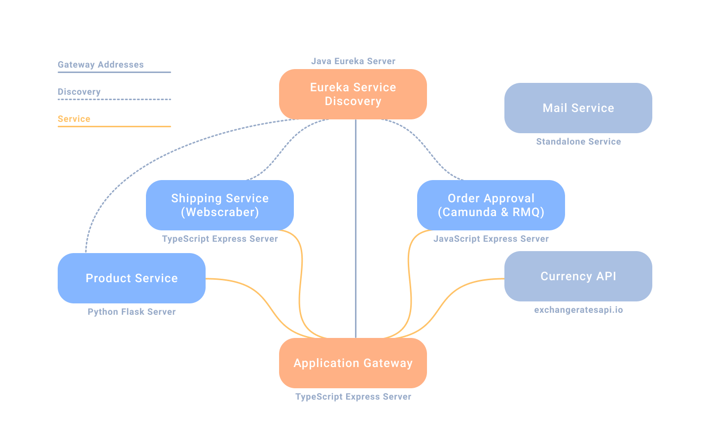
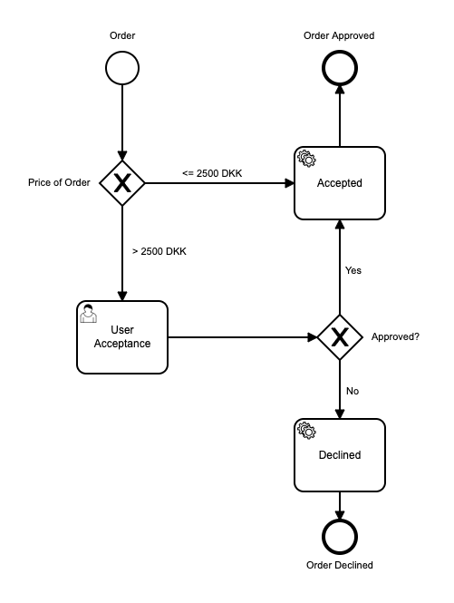
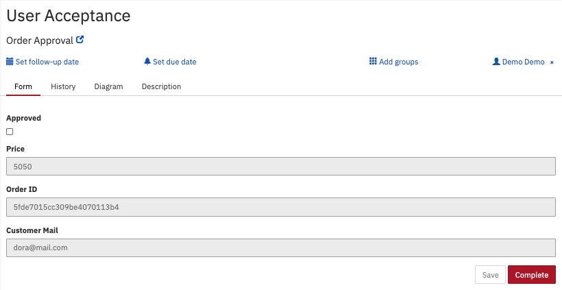
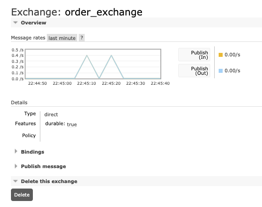
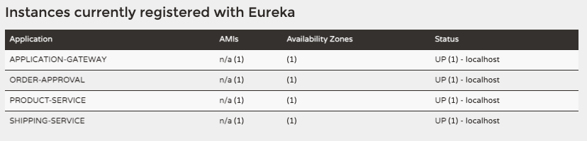

# Exam Project

_System Integration, Fall 2020_

## Business Case

There is no requirement for writing report. Instead the team is expected to add project description in a .md file in the GitHub repository, where the integration development process and considerations
are explained and visualized by diagrams.
Including an architectural diagram of the whole system and its components is a must.

In addition to the document, the team prepares a 10-minute video, presenting the project, where the business cases, problems and solutions can be further discussed, demonstrated, and evaluated.

## Use Case & Considerations

Approaching this project, we started by brainstorming different ideas, as to how we could incorporate all elements we've learned throughout the semester. This led us to a webshop-like architecture, utilizing different programming languages (Java, Python, JavaScript & TypeScript) and systems. This includes web scraping (Selenium) for delivery rates, database management (MongoDB), order management (Camunda), messaging (RabbitMQ) and currency conversion ([External Central Bank API](http://exchangeratesapi.io/)). 
 

## Integration

Eureka baby!



### Camunda BPMN



We utilize Camunda in the process of placing an order. If the Order is less than 2500 DKK, it will automatically be approved. However if the order is more than 2500, a task will be created in Camunda where a user can review it and decide wether to approve or decline the order.



### RabbitMQ

The RabbitMQ messaging system is used to send a message to the person placing an order, telling them if the order has been approved or declined.
This service is a part of the [mail-service](mail-service), which also has the job of adjusting the `approved: Boolean` on the order, depending on the response from [microservices/order-approval](microservices/order-approval).



### RESTful

### Legacy

We have integrated with [PostNord's onlineporto calculator](https://portal.postnord.com/onlineporto/) as a legacy system. This is done by web scraping the service to retrieve shipping prices based on the weight of the orders that the customers are trying to place. To do this we are utilizing the navigation, manipulation and data-retrieval capabilities of the npm package [selenuim-webdriver](https://www.npmjs.com/package/selenium-webdriver).

### Logging

We have implemented a simple logger in the Gateway application that logs all the errors thrown of type ServiceError. This uses the npm package called [tslogs](https://tslog.js.org/#/) that enables writing logs to a file locally. This is also the way we currently store the logs, but the package enables defining transports so further development can enable logging to an external server.

## Development Process

In the development process we have used pair programming together with the vscode plugin [liveshare](https://code.visualstudio.com/blogs/2017/11/15/live-share) (due to the current covid situation). Additionally we used a branching strategy via git to separate the development into master, development and feature branches.

## Installation & Execution

Below is a short description of how to install and start each system element.

##
#### Eureka

Navigate to [./eureka](eureka).

```bash
java -jar eureka.jar
```

##
#### Product Service

Navigate to [./microservices/product-service](microservices/product-service).

```bash
# bash
pip install -r requirements.txt

python src/app.py
```

##
#### Shipping Service

Navigate to [./microservices/shipping-service](microservices/shipping-service).

```bash
# bash
npm install && npm start
```

##
#### Mail Service

Start your **RabbitMQ** server.

Login to http://localhost:15672/#/

**Username:** `guest`  
**Password:** `guest`

Navigate to [./mail-service](mail-service).

```bash
# bash
npm install && npm start
```

##
#### Camunda

Start your **Camunda** server.

Open the Camunda tasklist and login with the credentials:
**Tasklist**: http://localhost:8080/camunda/app/tasklist/default/#

**Username:** `demo`  
**Password:** `demo`

Deploy [./microservices/order-approval/bpmn/order-approval.bpmn](microservices/order-approval/bpmn/order-approval.bpmn)

##
#### Gateway

Navigate to [./gateway](gateway).

```bash
# bash
npm install && npm start
```

##
#### Eureka Application Connections

Go to http://localhost:8761/

4 applications should be connected as shown on the image below:



##
### Using the API

| Entity             | Method     | Url                                             |
| ------------------ | ---------- | ----------------------------------------------- |
| **Product**        |  GET, POST | http://localhost:4000/product?id=PRODUCT_ID     |
| **All Products**   |  GET       | http://localhost:4000/product/all               |
| **Warehouse**      |  GET, POST | http://localhost:4000/warehouse?id=WAREHOUSE_ID |
| **All Warehouses** |  GET       | http://localhost:4000/warehouse/all             |
| **Order**          |  GET, POST | http://localhost:4000/order?id=ORDER_ID         |
| **All Orders**     |  GET       | http://localhost:4000/order/all                 |

##
### Using the Mail Service

**Language:** JavaScript

Navigate to [./mail-service](mail-service).

Place the email corresponding `<EMAIL>` to the purchase and get notified when it has been processed in **Order Approval Service**.

> The value defaults to *dora@mail.com*

```bash
# bash
npm start <EMAIL>
```
